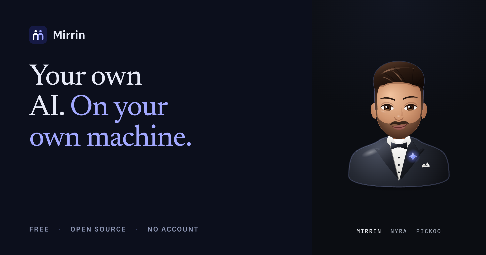
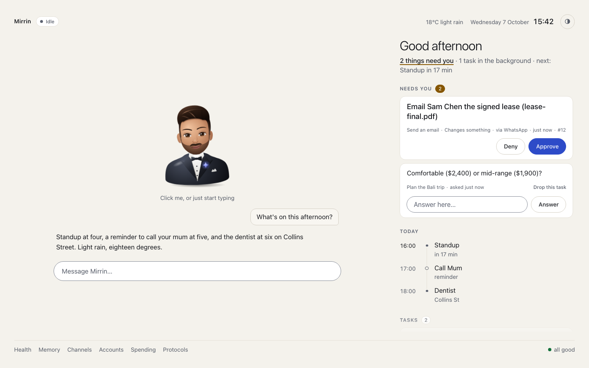
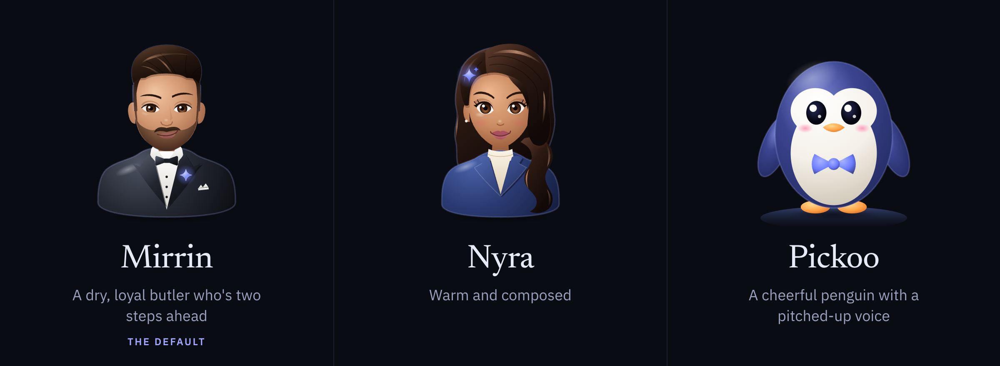

<p align="center"></p>

# Mirrin

**A personal AI that lives on your computer, remembers you, and gets things done for you, asking first.**

<p align="center">
  <picture>
    <source media="(prefers-color-scheme: dark)" srcset="docs/media/presence-dark.png">
    
  </picture>
  <br><sub>The presence screen on a busy afternoon (sample data): a request waiting for your yes, a question from a job in the background, and the rest of the day.</sub>
</p>

Mirrin is a twin: one program on your own machine, in the menu bar or system tray, that knows who you are and works for you. Text it from your phone, talk to it out loud, or leave it to run your routines. It uses the model you choose, keeps what it learns about you in files you own, and asks before it sends, books, pays or changes anything.

```
You:    flight to Sydney thursday 7am, book the usual cab
Mirrin: Noted. Cab for 5:10 from home is one approval away once you're
        happy with the time. I've put the flight on your calendar and
        I'll wake you at 4:30.
```

Website: [mirrin.app](https://mirrin.app)

## What it does for you

- **Text it from anywhere.** WhatsApp, Telegram, iMessage (on a Mac), Signal, Discord, Slack, Matrix, Mattermost, Zulip, IRC or email. Switch a channel on from the menu bar (**Channels…**); none needs a public address. It answers only you, recognised by something a stranger can't fake, such as your number or account id.
- **Talk to it.** Say its name ("Hey Mirrin") and ask. Listening and speaking happen on your computer: whisper.cpp hears you and a neural voice answers, sentence by sentence, and you can interrupt it. Voice notes you send it on WhatsApp, Telegram or Discord are transcribed on your computer too.
- **It asks first.** Every action is read, write or dangerous. Looking things up just happens; sending, creating, paying, running a command or opening a file with keys in it waits for your yes, and the request shows the whole message, command or script. Reply `yes 12` or `no 12`, tap Approve on the screen, or say "stop" and it stops at once.
- **It remembers you.** It keeps what you tell it, writes a portrait of you each week, notices what you keep asking for, and asks before it stores anything about your health, money, relationships or secrets. You can read and edit all of it.
- **It does things.** Your calendar, mail and files once you connect Google. Its own Chrome window stays signed in to your sites, so it can do jobs that have no API, and hands the window to you when a site needs you. Long jobs run in the background on a board you can see. Spending has limits it can't change.
- **Routines of its own.** Protocols are standing orders: "every weekday at 7, brief me on the day", "chase that refund". A fresh install comes with a morning briefing. You can write your own in a few lines, ask your twin to write one, or install packs other people share.
- **Someone you like.** Three personas come with it, each with its own name, character, way of talking and voice, drawn on the presence screen:
  - **Mirrin**, a dry, loyal butler who's two steps ahead (the default)
  - **Nyra**, warm and composed
  - **Pickoo**, a cheerful penguin with a pitched-up voice

  <p></p>

  Pick one when you start, switch from the menu bar, or write your own: a persona is one short YAML file, and you can call your twin anything.
- **A face for the room.** The presence screen (**Open screen…** in the menu) shows what it heard, what it's doing, what needs you and what's next, with big Approve and Deny buttons. After a minute of quiet it becomes a clock. Keep it in a laptop tab or on a screen on the wall.

## Your data stays yours

Mirrin runs on your machine. There is no Mirrin server between you and your twin: memory, portrait, personas, routines and settings are files in `~/.mirrin`, and `mirrin identity export` puts your whole twin in one archive you can take to another computer.

What leaves your machine is what you'd expect: requests to the model provider you chose (Claude, OpenAI or Gemini, with your own key), the chat apps and accounts you connect, and the websites it visits for you. Run a model locally with [Ollama](https://ollama.com) and your model requests stay on your computer too. Nothing listens on the internet unless you turn that on. Every outbound connection, and what it carries, is listed in [the threat model](docs/threat-model.md#outbound-connections).

## Install

You need macOS, Windows or Linux, and a model to think with: a key for Claude, OpenAI or Gemini (you pay them for what you use), or a free local model through Ollama.

Downloads are on the [Releases page](https://github.com/MavrkAI/Mirrin/releases).

**On a Mac:** download `Mirrin-<version>-macos.dmg` (one app for Apple silicon and Intel), drag Mirrin into Applications and open it. It lives in the menu bar. A Welcome window finds or checks your model key, asks which persona you'd like, and can restore a twin from an encrypted backup. Until the Mac builds are notarized by Apple, macOS blocks the app the first time you open it: choose System Settings → Privacy & Security → Open Anyway.

**On Windows:** download `Mirrin-<version>-windows-setup.exe` and run it. It installs for you alone, so it needs no administrator, offers to run `mirrin init` when it finishes, and offers to start your twin in the system tray each time you sign in.

**One line in a terminal.** On macOS or Linux:

```sh
curl -fsSL https://raw.githubusercontent.com/MavrkAI/Mirrin/main/install.sh | sh
```

On Windows, in PowerShell:

```powershell
irm https://raw.githubusercontent.com/MavrkAI/Mirrin/main/install.ps1 | iex
```

Both installers check every download against the release's published checksums before installing anything; if you have [cosign](https://github.com/sigstore/cosign), the macOS and Linux one also checks the checksums' signature. On a Mac it adds Mirrin.app as well. You're welcome to read [install.sh](install.sh) and [install.ps1](install.ps1) first.

**From source,** with the Go version in `go.mod` (and, on a Mac, the Xcode command line tools):

```sh
go install github.com/MavrkAI/Mirrin/cmd/mirrin@latest
```

## First steps

```sh
mirrin init               # who you are, which model, where to reach you
mirrin service install    # keep your twin running, and start it each time you sign in
```

`init` asks three things. Paste your model key when it asks, or pick Ollama and no key is needed; it checks the key works and keeps it on your machine. Give it your number and it pairs WhatsApp with a QR code. Then your twin has a first look around and introduces itself with something real it found. For the first week it suggests one thing a day; say "stop nudging" to end the tour.

Then:

- **Reach it from your phone:** menu bar → **Channels…**, and **Accounts…** to connect Google.
- **Chat in the terminal:** `mirrin chat`. On Windows or Linux, `mirrin tray` puts it in the system tray.
- **Talk to it:** run `mirrin voice setup` once (about 850 MB of models; on a Mac, `brew install whisper-cpp sox uv` first), then `mirrin voice --wake` and say its name.
- **Change who it is:** the Persona menu, or `mirrin persona list` and `mirrin persona use nyra` (the ids are `mirrin`, `nyra` and `pickoo`).
- **Find routines:** `mirrin protocols search travel`, or ask your twin "is there a protocol for commuting?".
- **Check on it:** `mirrin doctor` tests hearing, speaking, the model, connections, backups and spending, and offers repairs. `mirrin usage` shows what the model has cost this month.
- **Back it up:** `mirrin backup init` makes encrypted backups to a folder, iCloud Drive or an S3 bucket, locked with 12 words only you hold. `mirrin restore` brings your twin back on any machine.
- **Keep it current:** `mirrin update` upgrades when you ask, never on its own; `mirrin update --check` only says whether a release is out. `mirrin uninstall` removes only what is Mirrin's and keeps your twin unless you type "delete".

## Free and open source, with Mirrin Cloud planned

Mirrin is free, and the free twin is whole: every feature runs on your machine with nothing to buy. To use it away from home, text it on any of its channels, or reach the presence screen over [Tailscale](https://tailscale.com) or your own relay ([docs/reach.md](docs/reach.md)).

**Mirrin Cloud** is a paid service MavrkAI plans to offer. It isn't on sale. It would rent two things a server is good for: an address that reaches your machine from any network, and off-site space for encrypted backups. It would never hold your twin: connections end on your machine, and only your 12 words open a backup. Nothing free moves behind it, and your twin never pitches it. What it could and couldn't see, each with a way to check, is in [docs/cloud-trust.md](docs/cloud-trust.md).

## Licence

The source code is MIT. The default downloads include WhatsApp support, which uses GPL-3.0 code, so those downloads as a whole are GPL-3.0. Every release also has an MIT build without WhatsApp: install it with `MIRRIN_BUILD=nowhatsapp` set for the installer (for example `curl -fsSL https://raw.githubusercontent.com/MavrkAI/Mirrin/main/install.sh | MIRRIN_BUILD=nowhatsapp sh`), or build it with `go build -tags nowhatsapp -o mirrin ./cmd/mirrin`. A few included libraries keep their own MPL-2.0 licence. `mirrin licenses` prints the notices, and [docs/licensing.md](docs/licensing.md) explains what each build means.

## Learn more

- [Protocols](docs/protocols/README.md): writing, sharing and installing routines, starting with [your first protocol in ten minutes](docs/protocols/quickstart.md)
- [Personas](docs/personas.md): who your twin is, and how to write your own
- [Skills and channels](docs/skills.md): setting up each chat app, Google, the browser, voice, models and MCP servers
- [Backups](docs/backup.md) and [reaching your twin from anywhere](docs/reach.md)
- [Architecture](ARCHITECTURE.md): how it works inside
- [Contributing](CONTRIBUTING.md): building from source, writing skills, channels and protocols, and how the project is run
- [Security](SECURITY.md): please report vulnerabilities privately; the [threat model](docs/threat-model.md) says what Mirrin defends against
- [Changelog](CHANGELOG.md)

Everyone taking part agrees to the [Code of Conduct](CODE_OF_CONDUCT.md).
